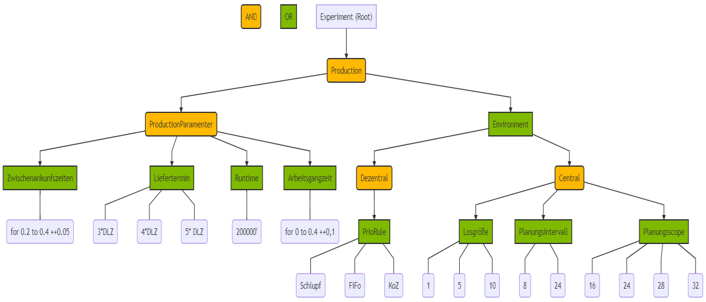

# Test different ways to walk throug composite data structures

[Compositum on Wikipedia](https://de.wikipedia.org/wiki/Kompositum_(Entwurfsmuster))

**Fig 1** Compositum Class.

* simple(); 
  * Connected Objects, recursive yield Enumeration
* counter(); 
  * Compositum // Array Counter, NO Recursion! 
  * Every recursion can be replaced by Iteration [Derived from: Böhm-Jacopini theorem](https://en.wikipedia.org/wiki/Structured_program_theorem) 
* linqy();  
  * Cartesian // Using Build in functions of Linq to build cartesian Product
  * Further information
    * [Iteration of Multidimensional Algorithms](https://julialang.org/blog/2016/02/iteration/)
    * [Computing a Cartesian Product with Linq](https://ericlippert.com/2010/06/28/computing-a-cartesian-product-with-linq/)
* complex();
  * OR as well as AND Connected Composites 
  * Combining the Cartesian and the recursive walk through the composite

**Fig 2** Experiment Tree Visualized.
